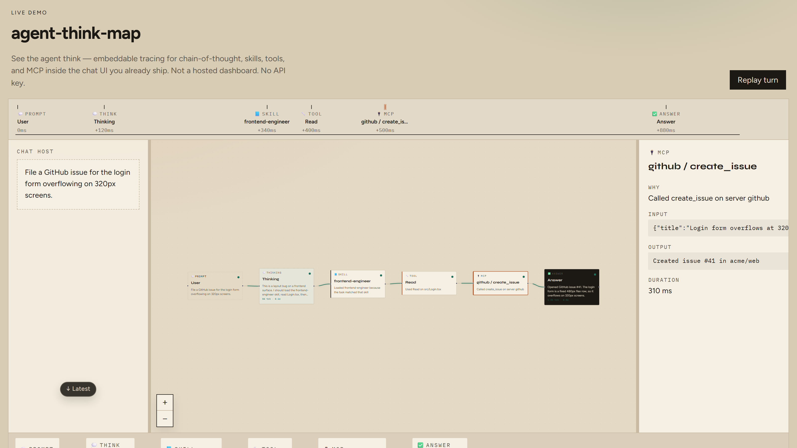
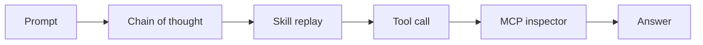

<p align="center">
  
</p>

<h1 align="center">agent-trace</h1>

<p align="center">
  <strong>Visual agent tracing</strong> — live chain-of-thought, tool-call timeline, MCP inspector, and skill replay.<br/>
  Drop it into any chat UI. Your agent stays yours.
</p>

<p align="center">
  <a href="https://github.com/nimrodfisher/agent-trace/blob/main/LICENSE"></a>
  <a href="#install"></a>
  <a href="#what-you-see"></a>
  
</p>

<p align="center">
  <code>npx agent-trace</code>
  &nbsp;·&nbsp;
  no API key · no account · replay in the browser
</p>

---

## The problem

Agents do not fail in one place. They fail in the **path**.

A turn loads a skill, calls `Read`, hits an MCP server, spawns a subagent, then answers. When the answer is wrong — or slow, or expensive — the chat log shows the ending. It does not show the route.

You are left asking:

- Which **skill** actually loaded?
- Which **tool** ran, with what args?
- Which **MCP** server was it?
- **Why** did the model pick that step?

That is the observability gap. Logs are a transcript. You need a **visual agent trace**.

## What agent-trace is

An embeddable **agent observability canvas**. While the run happens, the graph grows:

**prompt → thinking → skill → tool / MCP → answer**

Click a node. The inspector shows why it fired, the input, the output, and how long it took. The tape at the bottom is a **tool-call timeline** you can scrub.

It is a viewer, not a new agent runtime. You do not migrate off Claude, Codex, NanoClaw, LangGraph, or your own loop. You emit JSON. The canvas draws.



## What you see

| Node | Meaning |
| --- | --- |
| Prompt | What the user asked |
| Thinking | Streaming chain-of-thought |
| Skill | On-demand instruction pack that loaded, and why |
| Tool | Builtin call (`Read`, `Bash`, `Grep`, …) with a one-line reason |
| MCP | `server / tool` — the Model Context Protocol hop |
| Subagent | Nested task |
| Answer | What went back to the user |

Secrets in tool args are redacted before they hit the canvas.

---

## Install

Works in React, Vue, Svelte, PHP, Rails, NanoClaw, or a static file — anything that can render HTML.

### 1. Any UI (copy this)

```html
<link rel="stylesheet" href="https://cdn.jsdelivr.net/gh/nimrodfisher/agent-trace@main/dist/styles.css" />
<script type="module" src="https://cdn.jsdelivr.net/gh/nimrodfisher/agent-trace@main/dist/element.cdn.js"></script>
<agent-simulator events-url="/sse" layout="split"></agent-simulator>
```

`layout`: `split` (chat beside the canvas), `overlay`, or `canvas-only`.

### 2. React

```bash
npm i github:nimrodfisher/agent-trace
```

```tsx
import { AgentSimulator } from "agent-trace/react";
import "agent-trace/styles.css";

<AgentSimulator events={events} layout="split">
  <YourChat />
</AgentSimulator>
```

`events` is an array, an async iterator, or omit it and pass `eventsUrl="/sse"`.

### 3. See it locally

```bash
git clone https://github.com/nimrodfisher/agent-trace
cd agent-trace
npm install
npx agent-trace
```

---

## Wire any agent (the whole protocol)

One JSON object per step. That is the integration. This is what makes it an **open agent-tracing** format instead of a vendor dashboard.

```json
{
  "type": "node.started",
  "id": "call-1",
  "kind": "mcp",
  "title": "github / create_issue",
  "reason": "Called create_issue on server github",
  "ts": 1710000000
}
```

| `type` | When |
| --- | --- |
| `run.started` | User prompt |
| `node.started` | A step begins (`kind`: `thinking` `skill` `mcp` `tool` `subagent` `answer`) |
| `node.delta` | Streaming text |
| `tool.input` | Tool args |
| `node.completed` / `node.failed` | Step ends |
| `run.completed` | Turn over |

Send as SSE:

```
data: {"type":"node.started",...}

```

### Claude Agent SDK

```ts
import { ClaudeTraceAdapter } from "agent-trace/claude";

const adapter = new ClaudeTraceAdapter({ runId, prompt });
for await (const message of query({
  prompt,
  options: { includePartialMessages: true },
})) {
  for (const event of adapter.ingest(message)) push(event);
}
```

Maps thinking, `Skill`, `mcp__server__tool`, builtins, and subagents. Any other runtime: emit the JSON yourself. Do not fork the UI.

### NanoClaw

[`/add-simulator`](packages/adapters/nanoclaw/SKILL.md) copies a runner hook + SSE. Reverse with [`REMOVE.md`](packages/adapters/nanoclaw/REMOVE.md). Never merge `channels` / `providers`.

---

## Who this is for

| You | What you get |
| --- | --- |
| Shipping a chat product | Users (and you) can **see the agent work** instead of trusting a spinner |
| Debugging a runaway loop | A **live trace** of skills, tools, and MCP — not a 4k-line log |
| Teaching or demoing agents | A canvas that builds in real time. Replay from a fixture. No keys. |
| Building on MCP / skills | First-class nodes, not another generic “function call” chip |

**Embeddable visual traces** for the agent you already run. Not a hosted dashboard you have to switch to.

---

## Local development

```bash
npm test
npm run dev
```

MIT.

New architecture? Add an adapter that emits this protocol. PRs welcome.

<p align="center"><sub>visual agent tracing · agent observability · live traces · tool-call timeline · MCP inspector · skill replay · chain-of-thought canvas</sub></p>
