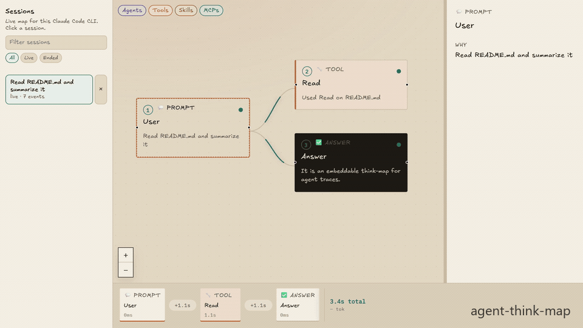
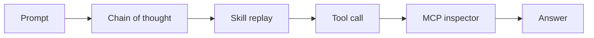

<p align="center">
  
</p>

<h1 align="center">agent-think-map</h1>

<p align="center">
  <strong>See the agent think</strong> — chain-of-thought, skills, tools, and MCP.<br/>
  <strong>Model-agnostic.</strong> Same canvas in the chat UI you ship, or beside Claude Code and Codex.
</p>

<p align="center">
  <a href="https://nimrodfisher.github.io/agent-think-map/">Live demo</a>
  &nbsp;·&nbsp;
  <code>npx agent-think-map claude --install</code>
  &nbsp;·&nbsp;
  <code>npx agent-think-map codex --install</code>
  &nbsp;·&nbsp;
  no API key
</p>

<p align="center">
  <a href="https://www.npmjs.com/package/agent-think-map"></a>
  <a href="https://github.com/nimrodfisher/agent-think-map/blob/main/LICENSE"></a>
  <a href="#two-doors-same-canvas"></a>
  <a href="#embed-in-a-chat-ui"></a>
  <a href="#claude-code-cli"></a>
  <a href="#codex-desktop-and-cli"></a>
  <a href="#what-you-see"></a>
</p>

---

## Two doors, same canvas

The **viewer** does not care which model ran the turn. Model is a column on the session, not a vendor lock.

| You | Door |
| --- | --- |
| Shipping a chat UI | [Embed the canvas](#embed-in-a-chat-ui) — four lines, SSE / JSON. Claude, Codex, OpenAI, or your own loop. |
| Living in Claude Code | [CLI studio](#claude-code-cli) — one command, graph in the browser, Claude stays in the terminal. |
| Living in Codex | [Codex studio](#codex-desktop-and-cli) — one command, graph in the browser, Codex stays in its normal interface. |

If you already emit the protocol (or use `TraceAdapter`), you do not wait for a new adapter to **see** the graph. NanoClaw copies a runner hook; any other runtime can POST the JSON yourself.

---

## Claude Code CLI

The same live canvas, beside the terminal. Claude Code stays in the CLI. A local studio lists sessions and draws the route as hooks fire.

```bash
npx agent-think-map claude --install
```

1. Keep that process running. A browser tab opens `http://127.0.0.1:3334`.
2. `--install` writes HTTP hooks into **this folder’s** `.claude/settings.local.json` (the folder where you start `claude`, 5s timeout, never blocks Stop). SessionStart is a command hook that forwards the **model** name, because Claude Code does not send that event over HTTP.
3. Restart `claude` if it was already open. Ask it to use a tool (`Read README.md`). The graph grows in the browser.

`--port 3334` · `--no-open` · `--smoke` (sample turn, no Claude) · `--print-hooks`

The **one-command CLI install** is Claude Code (HTTP hooks) and Codex (command hooks). This studio is the same viewer as the [embed](#embed-in-a-chat-ui).

### Studio

| Surface | What it does |
| --- | --- |
| Session rail | Search sessions. Filter live / ended, **model**, and effort. Token totals when the transcript reports them. Remove a session from the list. |
| Canvas | Prompt → thinking → skill / tool / MCP / subagent → answer. Filter Agents, Tools, Skills, MCPs. Chronological badges reset on each user prompt. |
| Inspector | Click a node: why it ran, pretty-printed input and output (SQL / JSON), duration. Selection stays on what you clicked. |
| Timeline | Scrub the turn. Elapsed time and compact token totals stay on the right. |

A **Stop** (end of a turn) is not the end of the Claude session. The rail marks a session **ended** on Claude’s `SessionEnd`. Parallel tools and subagents show as siblings, not a fake chain.

Install hooks in the **cwd you actually launch `claude` from**. If studio is already on 3334, `--install` still writes hooks and exits; do not start a second server.

<p align="center">
  
</p>

---

## Codex Desktop and CLI

The same live canvas works beside **Codex Desktop** and the **Codex CLI**. Codex stays in its normal interface; agent-think-map runs a small local studio at `127.0.0.1:3335` and receives lifecycle events through Codex command hooks.

### Install once for all Codex sessions

Run this in any terminal:

```bash
npx agent-think-map codex --install
```

Then:

1. Keep the command running. It starts the local studio and opens `http://127.0.0.1:3335`.
2. Restart Codex Desktop or the Codex CLI so it reloads the new hooks.
3. If Codex asks you to review or trust the `agent-think-map` hook command, approve it if you want tracing enabled.
4. On the first session, Codex asks whether to share prompts and tool events with the local map. Reply `yes`, `no`, or `later`.
5. After `yes`, continue using Codex normally. The current and future sessions appear in the browser.

The default install writes user-level hooks to `~/.codex/hooks.json`, so it covers future Codex projects and sessions, including Codex Desktop sessions using that Codex installation. It does not require an API key. The hook forwards data only to the local studio after you opt in.

**Codex Desktop users:** run the install command from any terminal once, keep the studio process running, and then use Codex Desktop normally. Codex does not need to be launched from that terminal.

To install for one project instead, run this from that project:

```bash
npx agent-think-map codex --install --project
```

That writes project-level hooks to `<project>/.codex/hooks.json`. Use the project-level option when you do not want the integration enabled for other projects.

### What consent means

- `yes` enables the map for the current and future Codex sessions.
- `no` continues the Codex session without forwarding prompts or tool events.
- `later` defers the decision for that session.

The original prompt is held only until the choice is made. Re-running the **user-level** `--install` is safe and idempotent, and resets the consent prompt so you can choose again. Existing hooks from other tools are preserved; only older agent-think-map hooks are replaced.

### What the Codex studio shows

- **Session rail:** search and filter by live/ended status, model, and reasoning effort. Session rows can show token totals, cached tokens, cost when Codex reports it, and event counts.
- **Canvas:** prompt → skill / tool / MCP / subagent → answer. Skills loaded from Codex or plugin skill paths are labeled as Skill nodes.
- **Inspector:** click any node to see why it ran plus available input, output, and duration.
- **Timeline:** scrub the turn and inspect compact run totals.

Codex lifecycle hooks do **not** stream chain-of-thought, so thinking nodes do not appear on this path. The map does show prompts, builtin tools, skills, MCP calls, subagents, answers, and the model/effort metadata available from the Codex session record. For reasoning items, ingest [Codex app-server](#any-agent-claude-codex-openai) notifications with `TraceAdapter` / `agent-think-map/codex`.

A **Stop** (end of a turn) is not the end of the Codex session. The rail marks a session **ended** only when Codex emits `SessionEnd`.

### Useful commands

```bash
# Start the live studio without changing hook settings
npx agent-think-map codex

# Start without opening a browser window
npx agent-think-map codex --no-open

# Print the generated Codex hook configuration
npx agent-think-map codex --print-hooks

# Load a fake session for a UI demo; omit --smoke for live Codex tracing
npx agent-think-map codex --smoke
```

If the studio is already running on port 3335, re-running `--install` still writes the hooks and exits. Do not start a second studio. Use `--port <number>` if another local service owns 3335.

---

## Embed in a chat UI

Four lines. Point `events-url` at your agent's SSE.

```html
<link rel="stylesheet" href="https://cdn.jsdelivr.net/npm/agent-think-map@0.1.1/dist/styles.css" />
<script type="module" src="https://cdn.jsdelivr.net/npm/agent-think-map@0.1.1/dist/element.cdn.js"></script>
<agent-think-map events-url="/sse" layout="split"></agent-think-map>
```

`layout`: `split` (chat beside the canvas), `overlay`, or `canvas-only`. `<agent-simulator>` still works as an alias.

### React

```bash
npm i agent-think-map
```

```tsx
import { AgentSimulator } from "agent-think-map/react";
import "agent-think-map/styles.css";

<AgentSimulator events={events} layout="split">
  <YourChat />
</AgentSimulator>
```

`events` is an array, an async iterator, or omit it and pass `eventsUrl="/sse"`.

### Try the recorded demo

```bash
npx agent-think-map
```

No account. No API key. Replays a recorded GitHub-issue turn in the browser.

---

## What you see

| Node | Meaning |
| --- | --- |
| Prompt | What the user asked |
| Thinking | Streaming chain-of-thought |
| Skill | On-demand instruction pack that loaded, and why |
| Tool | Builtin call (`Read`, `Bash`, `Grep`, …) with a one-line reason |
| MCP | `server / tool` — the Model Context Protocol hop |
| Subagent | Nested task |
| Answer | What went back to the user |

Secrets in tool args are redacted before they hit the canvas. The embed and the Claude Code / Codex studios share this graph, inspector, and timeline.

---

## The problem

Agents do not fail in one place. They fail in the **path**.

A turn loads a skill, calls `Read`, hits an MCP server, spawns a subagent, then answers. When the answer is wrong — or slow, or expensive — the chat log **and** the terminal show the ending. They do not show the route.

You are left asking:

- Which **skill** actually loaded?
- Which **tool** ran, with what args?
- Which **MCP** server was it?
- **Why** did the model pick that step?
- Which **model**, and how many **tokens**?

Logs are a transcript. You need the route — inside the chat you already ship, or beside Claude Code or Codex. Same map. Any model you can emit.

## What agent-think-map is

An embeddable canvas. While the run happens, the graph grows:

**prompt → thinking → skill → tool / MCP → answer**

Click a node. The inspector shows why it fired, the input, the output, and how long it took. The tape at the bottom is a **tool-call timeline** you can scrub.

It is a viewer, not a new agent runtime. You do not migrate off Claude Code, Claude, Codex, NanoClaw, LangGraph, or your own loop. You emit JSON. The canvas draws.

If you need a hosted trace warehouse, use LangSmith. If you need the trace *beside the CLI or inside the chat you already ship*, this is the canvas.



---

## Wire any agent (the whole protocol)

One JSON object per step. That is the integration.

```json
{
  "type": "node.started",
  "id": "call-1",
  "kind": "mcp",
  "title": "github / create_issue",
  "reason": "Called create_issue on server github",
  "ts": 1710000000
}
```

| `type` | When |
| --- | --- |
| `run.started` | User prompt |
| `run.meta` | Optional session `model`, `effort`, `usage` |
| `node.started` | A step begins (`kind`: `thinking` `skill` `mcp` `tool` `subagent` `answer`) |
| `node.delta` | Streaming text |
| `tool.input` | Tool args |
| `node.completed` / `node.failed` | Step ends. Optional `usage` (tokens / `costUsd`) when the runtime reports it |
| `run.completed` | Turn over. Optional `usage`: `{ inputTokens, outputTokens, costUsd }` |

Send as SSE:

```
data: {"type":"node.started",...}

```

### Any agent (Claude, Codex, OpenAI)

One ingest. The adapter sniffs the live stream and locks onto Claude Agent SDK, OpenAI Agents SDK, or Codex app-server JSON-RPC.

```ts
import { TraceAdapter } from "agent-think-map";

const adapter = new TraceAdapter({ runId, prompt });
for (const event of adapter.ingest(native)) push(event);
```

Codex app-server:

```ts
notification → adapter.ingest({ method, params })
```

OpenAI Agents SDK:

```ts
for await (const event of result.stream_events()) {
  for (const frame of adapter.ingest(event)) push(event);
}
```

Claude Agent SDK:

```ts
for await (const message of query({ prompt, options: { includePartialMessages: true } })) {
  for (const event of adapter.ingest(message)) push(event);
}
```

Optional explicit imports: `agent-think-map/claude`, `agent-think-map/openai`, `agent-think-map/codex`, `agent-think-map/claude-code`. Any other runtime: emit the JSON yourself. Do not fork the UI.

### NanoClaw

[`/add-simulator`](packages/adapters/nanoclaw/SKILL.md) copies a runner hook + SSE. Reverse with [`REMOVE.md`](packages/adapters/nanoclaw/REMOVE.md). Never merge `channels` / `providers`.

---

## Who this is for

| You | What you get |
| --- | --- |
| Shipping a chat product | Users (and you) can **see the agent think** — any model you emit — instead of trusting a spinner |
| Using **Claude Code** in the terminal | The same map in the browser: sessions, model, tokens, the route — without leaving the CLI |
| Using **Codex Desktop or CLI** | The same map: sessions, model, effort, skills, tools, and MCP as hooks fire — without changing your Codex workflow |
| Debugging a runaway loop | A **live trace** of skills, tools, and MCP — not a 4k-line log |
| Teaching or demoing agents | A canvas that builds in real time. Replay from a fixture. No keys. |
| Building on MCP / skills | First-class nodes, not another generic “function call” chip |

**Not for you** if you want a hosted trace warehouse. Keep LangSmith or Langfuse for that. This is the in-product / beside-the-CLI canvas.

---

## Local development

```bash
npm test
npm run dev
```

MIT. New architecture? Add an adapter that emits this protocol. PRs welcome.
