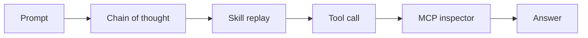

<p align="center">
  
</p>

<h1 align="center">agent-think-map</h1>

<p align="center">
  <strong>See the agent think</strong> — chain-of-thought, skills, tools, and MCP<br/>
  inside the chat UI you already ship. Not a hosted dashboard.
</p>

<p align="center">
  <a href="https://nimrodfisher.github.io/agent-think-map/">Live demo</a>
  &nbsp;·&nbsp;
  <code>npx agent-think-map</code>
  &nbsp;·&nbsp;
  no API key
</p>

<p align="center">
  <a href="https://github.com/nimrodfisher/agent-think-map/blob/main/LICENSE"></a>
  <a href="#install"></a>
  <a href="#what-you-see"></a>
</p>

---

## Install

Four lines. Point `events-url` at your agent's SSE.

```html
<link rel="stylesheet" href="https://cdn.jsdelivr.net/gh/nimrodfisher/agent-think-map@main/dist/styles.css" />
<script type="module" src="https://cdn.jsdelivr.net/gh/nimrodfisher/agent-think-map@main/dist/element.cdn.js"></script>
<agent-think-map events-url="/sse" layout="split"></agent-think-map>
```

`layout`: `split` (chat beside the canvas), `overlay`, or `canvas-only`. `<agent-simulator>` still works as an alias.

### React

```bash
npm i agent-think-map
```

Until the npm release is live: `npm i github:nimrodfisher/agent-think-map`

```tsx
import { AgentSimulator } from "agent-think-map/react";
import "agent-think-map/styles.css";

<AgentSimulator events={events} layout="split">
  <YourChat />
</AgentSimulator>
```

`events` is an array, an async iterator, or omit it and pass `eventsUrl="/sse"`.

### Try it locally

```bash
npx agent-think-map
```

No account. No API key. Replays a recorded GitHub-issue turn in the browser.

---

## What you see

| Node | Meaning |
| --- | --- |
| Prompt | What the user asked |
| Thinking | Streaming chain-of-thought |
| Skill | On-demand instruction pack that loaded, and why |
| Tool | Builtin call (`Read`, `Bash`, `Grep`, …) with a one-line reason |
| MCP | `server / tool` — the Model Context Protocol hop |
| Subagent | Nested task |
| Answer | What went back to the user |

Secrets in tool args are redacted before they hit the canvas.

---

## The problem

Agents do not fail in one place. They fail in the **path**.

A turn loads a skill, calls `Read`, hits an MCP server, spawns a subagent, then answers. When the answer is wrong — or slow, or expensive — the chat log shows the ending. It does not show the route.

You are left asking:

- Which **skill** actually loaded?
- Which **tool** ran, with what args?
- Which **MCP** server was it?
- **Why** did the model pick that step?

Logs are a transcript. You need the route, inside the chat you already ship.

## What agent-think-map is

An embeddable canvas. While the run happens, the graph grows:

**prompt → thinking → skill → tool / MCP → answer**

Click a node. The inspector shows why it fired, the input, the output, and how long it took. The tape at the bottom is a **tool-call timeline** you can scrub.

It is a viewer, not a new agent runtime. You do not migrate off Claude, Codex, NanoClaw, LangGraph, or your own loop. You emit JSON. The canvas draws.

If you need a hosted trace warehouse, use LangSmith. If you need the trace *inside the chat you already ship*, this is the canvas.



---

## Wire any agent (the whole protocol)

One JSON object per step. That is the integration.

```json
{
  "type": "node.started",
  "id": "call-1",
  "kind": "mcp",
  "title": "github / create_issue",
  "reason": "Called create_issue on server github",
  "ts": 1710000000
}
```

| `type` | When |
| --- | --- |
| `run.started` | User prompt |
| `node.started` | A step begins (`kind`: `thinking` `skill` `mcp` `tool` `subagent` `answer`) |
| `node.delta` | Streaming text |
| `tool.input` | Tool args |
| `node.completed` / `node.failed` | Step ends. Optional `usage` (tokens / `costUsd`) when the runtime reports it |
| `run.completed` | Turn over. Optional `usage`: `{ inputTokens, outputTokens, costUsd }` |

Send as SSE:

```
data: {"type":"node.started",...}

```

### Any agent (Claude, Codex, OpenAI)

One ingest. The adapter sniffs the live stream and locks onto Claude Agent SDK, OpenAI Agents SDK, or Codex app-server JSON-RPC.

```ts
import { TraceAdapter } from "agent-think-map";

const adapter = new TraceAdapter({ runId, prompt });
for (const event of adapter.ingest(native)) push(event);
```

Codex app-server:

```ts
notification → adapter.ingest({ method, params })
```

OpenAI Agents SDK:

```ts
for await (const event of result.stream_events()) {
  for (const frame of adapter.ingest(event)) push(event);
}
```

Claude Agent SDK:

```ts
for await (const message of query({ prompt, options: { includePartialMessages: true } })) {
  for (const event of adapter.ingest(message)) push(event);
}
```

Optional explicit imports: `agent-think-map/claude`, `agent-think-map/openai`, `agent-think-map/codex`. Any other runtime: emit the JSON yourself. Do not fork the UI.

### NanoClaw

[`/add-simulator`](packages/adapters/nanoclaw/SKILL.md) copies a runner hook + SSE. Reverse with [`REMOVE.md`](packages/adapters/nanoclaw/REMOVE.md). Never merge `channels` / `providers`.

---

## Who this is for

| You | What you get |
| --- | --- |
| Shipping a chat product | Users (and you) can **see the agent think** instead of trusting a spinner |
| Debugging a runaway loop | A **live trace** of skills, tools, and MCP — not a 4k-line log |
| Teaching or demoing agents | A canvas that builds in real time. Replay from a fixture. No keys. |
| Building on MCP / skills | First-class nodes, not another generic “function call” chip |

**Not for you** if you want a hosted trace warehouse. Keep LangSmith or Langfuse for that. This is the in-product canvas.

---

## Local development

```bash
npm test
npm run dev
```

MIT. New architecture? Add an adapter that emits this protocol. PRs welcome.
